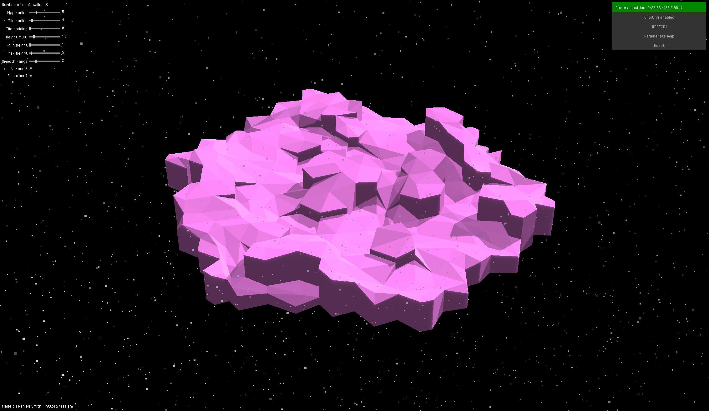

# Ashley Rose - Hexagonal Voronoi Terrain Generator

## What is this?
I build this as part of my introduction to both [Haxe](https://haxe.org/) and [Heaps](https://heaps.io/). I started off with their [sample projects](https://heaps.io/samples/) and iterated until I had a good handle about what tools were available. The result is something similar to another project of mine, [HexagonalHS](https://aas.sh/project/hexagonalhs/).

You can find more information on my website, [aas.sh/project/hex-voronoi](https://aas.sh/project/hex-voronoi/). Additionally, you can test this project live at [https://aas.sh/Hex-Voronoi](https://aas.sh/Hex-Voronoi/).

## How do I use it?
By default, the application will rotate around the map. You can disable this orbiting mode in the top right corner. From there, you can control the camera with your mouse and zoom in with the scroll wheel.

In the top left, you'll find various settings for changing how the terrain looks. In the top right, you'll find functions like changing the map's colour, regenerating the map, and resetting all settings to default.

## How do I compile it?
This project was created using [Haxe](https://haxe.org/) and can be compiled in two ways. Before attempting compilation, you'll need to [install Haxe and Heaps](https://heaps.io/documentation/installation.html). Additionally, you'll need to install `seedyrng` and `domkit` via `haxelib install <package>`.

### Visual Studio Code:
[Haxe](https://haxe.org/) works very well with [Visual Studio Code](https://code.visualstudio.com/) when using the [Haxe Extension Pack](https://marketplace.visualstudio.com/items?itemName=vshaxe.haxe-extension-pack). When everything is installed, you should be able to hit `CTRL+SHIFT+B` to build the project. It'll compile to JS and be found in the `docs` folder, which you can then test by opening `index.html` in your web browser.

### Command line:
After installing dependencies, you can run `haxe build.hxml` to compile the project. A JS file will appear in the `docs` folder and you can then test it by opening `index.html` in your web browser.